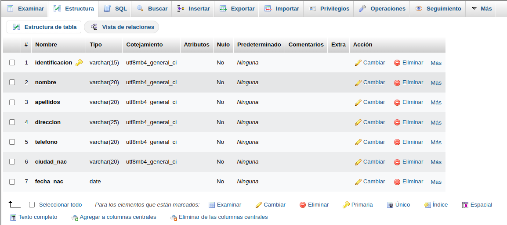
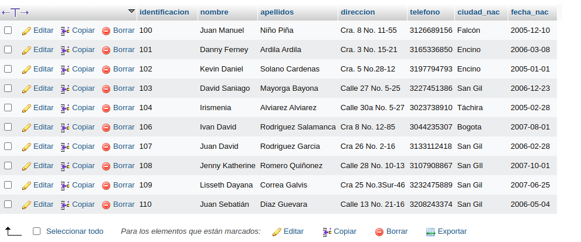

# Introducción a SQL

1. Creación de una base de datos (BD) con MySQL usando phpMyAdmin

## Creación Tabla Cliente
### Diccionario de Datos
|Campo|Tipo de Dato|Longitud|
|-----|------------|--------|
|***identificación**|varchar|15|
|nombre|varchar|20|
|apellido|varchar|20|
|dirección|varchar|25|
|telefono|varchar|20|
|ciudad_nac|varchar|20|
|fecha_nac|date||

### Codigo SQL de creacion tabla Clientes
CREATE TABLE `Ventas`.`Cliente` (`identificacion` VARCHAR(15) NOT NULL , `nombre` VARCHAR(20) NOT NULL , `apellidos` VARCHAR(20) NOT NULL , `direccion` VARCHAR(25) NOT NULL , `telefono` VARCHAR(20) NOT NULL , `ciudad_nac` VARCHAR(20) NOT NULL , `fecha_nac` DATE NOT NULL , PRIMARY KEY (`identificacion`)) ENGINE = InnoDB;

### Diccionario de Datos en PhpMyAdmin

### Registro de datos en Tabla Cliente

#### Codigo SQL de inserción de un registro a la tabla Cliente

INSERT INTO `Ciente` (`identificacion`, `nombre`, `apellidos`, `direccion`, `telefono`, `ciudad_nac`, `fecha_nac`) VALUES ('100', 'Juan Manuel', 'Niño Piña', 'Cra. 8 No. 11-55', '3126689156', 'Falcón', '2005-12-10');

#### Primeros registro en phpMyAdmin

